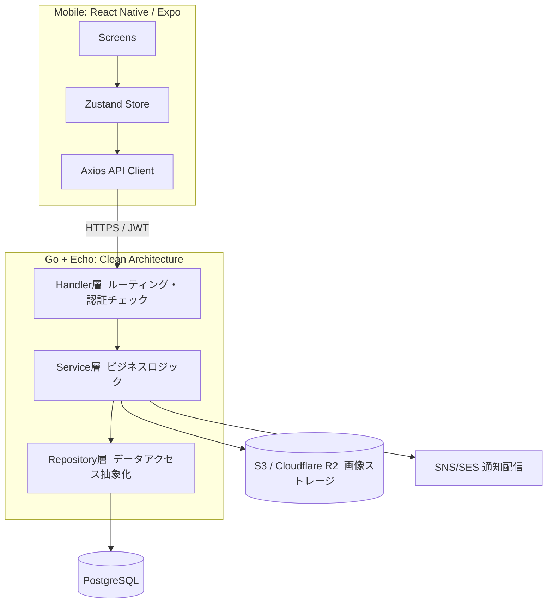

# Secure Scorecard（マイガーデン）

家庭菜園の記録を、続けられるものに変える。

家庭菜園は水やりや施肥のタイミングを忘れがちで、記録も残らないまま次のシーズンを迎えてしまいがちです。Secure Scorecard は、作物の種まきから収穫までのライフサイクルを記録し、定期タスクをリマインドし、収穫データを可視化することで、栽培を「なんとなく」から「振り返って改善できるもの」に変えるモバイルアプリです。

Go(Echo) によるバックエンドと React Native(Expo) によるモバイルアプリを Turborepo モノレポで構成し、要件定義から設計、実装、インフラ構築、テストまでを一人で担当しました。

Live Demo（Web）: https://home-garden-management.expo.app （ブラウザでそのまま操作できます）
Live Demo（API）: https://secure-scorecard-backend.onrender.com/health （稼働確認済み。無料枠のため15分無アクセスでスリープし、初回アクセス時は起動に10秒ほどかかります）

---

## このプロジェクトが伝えたいこと

一人で作ったプロダクトですが、進め方はチーム開発そのものです。タスクごとに feature ブランチを切り、Pull Request を作成してからマージするフローを最後まで崩さず、30 件の PR、93 件のコミットを積み重ねました。

途中で何度か、動くけれど正しくない実装を作ってしまいました。API のレスポンス形状を推測して型エラーに気づかなかったこと、pnpm と Expo の依存解決がかみ合わずアプリが起動しなかったこと、ループの中で1件ずつ DB を削除して N+1 を発生させたこと。そのたびに原因を切り分け、二度と踏まない仕組み（レビュー観点、ドキュメント、実装ルール）に落とし込んできました。このプロジェクトは、その積み重ねの記録でもあります。

---

## プロダクト概要

課題は明快です。家庭菜園は世話のタイミングを忘れやすく、記録が残らないので改善につながりません。Secure Scorecard は、作物・区画・作業タスク・収穫データ・通知という 6 つのドメインを組み合わせ、この課題を一本のモバイルアプリで解決します。

ターゲットはベランダ、庭、市民農園などで家庭菜園を行う個人。プラットフォームは iOS / Android のモバイル専用アプリです。

### 6つのドメインでできること

| ドメイン     | 提供する価値                                                       |
| ------------ | ------------------------------------------------------------------ |
| User         | JWT認証（HttpOnly Cookie）とプロフィール管理                       |
| Crop         | 種まきから収穫までのライフサイクル記録、写真付きタイムライン、メモ |
| Plot         | 区画（プランター・畑）の登録、作物の割り当て、稼働状況の可視化     |
| Task         | 水やり・施肥などの定期タスク自動生成、繰り返し設定、完了記録       |
| Analytics    | 収穫量統計、成長曲線、タスク完了率、CSVエクスポート                |
| Notification | Push / Email によるリマインダー（Expo Push / AWS SNS・SES）        |

---

## アーキテクチャ

Clean Architecture と Repository パターンを採用し、Handler から Service、Repository、Database へ一方向にしか依存しない構成にしています。DB を PostgreSQL から別の RDBMS に差し替えられるかどうかを、Repository パターンが正しく実装できているかの基準にしています。



### インフラは、本番想定と公開用の2段構え

本番運用を想定した構成は AWS です。ECS Fargate、RDS、S3、CloudFront、SNS、SES、Secrets Manager までを Terraform でコード化し、`infrastructure/` 配下に実装しました（該当コミット: `a29380b`）。

一方で、面接や日常のポートフォリオ閲覧のために常時 AWS 環境を起動しておくのはコストが見合いません。そこで直近の対応として、Render（Web Service）、Neon（Serverless Postgres）、Cloudflare R2（S3互換ストレージ）という無料枠だけで完結する構成に一本化しました。この切り替えに伴い、Terraform 一式は現在のリポジトリのツリーからは削除しています。設計と実装はコミット履歴に残っており、`git show a29380b` などで確認できます。手順は `docs/deploy-free.md` にまとめています。

---

## 技術スタック

バックエンドは Go 1.24、Echo v4、GORM v2、PostgreSQL 16、golang-jwt v5、zerolog、viper。
モバイルは React Native 0.81、Expo SDK 54、TypeScript、React Query v5、Zustand、NativeWind。
インフラは AWS（ECS Fargate / RDS / S3 / CloudFront / SNS / SES）を Terraform で設計し、公開用には Render / Neon / Cloudflare R2 を使用。
モノレポ管理は Turborepo 2.x と pnpm 9.x。
テストは Go の `testing` と `httptest`、モバイルは Jest と Testing Library、そのほか `tests/` 配下に統合・E2E・パフォーマンステストを整備しています。

---

## 設計と実装で工夫したこと

JWT のログアウトは、Redis を使わずステートレスなまま安全に実現しました。失効させたトークンの jti を PostgreSQL の token_blacklist テーブルに記録し、複合インデックスで高速に判定します。インフラを増やさずに即時失効を実現するための選択です。

N+1 問題は、一度自分のコードで踏んでから対策を仕組み化しました。ループの中で1件ずつ削除するのではなく、WHERE IN や WHERE parent_id = ? によるバッチ操作を徹底し、レビュー観点として「ループの中で DB 操作をしていないか」を明文化しました。

フロントエンドの型は、バックエンドの実装を確認してから定義するようにしています。レスポンスの形を推測して型を書き、実行時までエラーに気づかなかった経験から、「API 型は Handler の return を読んでから書く」というルールに落とし込みました。

pnpm モノレポと Expo の組み合わせでは、依存関係の解決方式が食い違い、babel-preset-expo が見つからずアプリが起動しない問題に当たりました。`.npmrc` の shamefully-hoist とカスタムエントリーポイントの追加で解消しています。

そして、一人で開発していても、main ブランチへの直接コミットは禁止し、タスクごとに feature ブランチから PR を経てマージするフローを最後まで守りました。仕様と実装がずれた場合は、その都度 `.kiro/specs` のドキュメントを更新し、仕様と実装が食い違ったままにしないようにしています。

---

## テストと品質

バックエンドは Handler、Service、Repository の各層に単体テストを持ち、テストコードは約 5,600 行あります。Docker Compose 上の PostgreSQL に対する統合テストも用意しています。モバイルは Jest と React Testing Library でテストし、`tests/` 配下には統合・E2E・パフォーマンステストをまとめています。

```
pnpm test         全パッケージのテスト実行
pnpm lint         Lint
pnpm type-check   型チェック
```

---

## セットアップ

Node.js 18 以上、pnpm 9 以上、Go 1.23 以上が必要です。AWS 構成を試す場合は Terraform も必要になりますが、前述の通り現在のツリーには含まれていないため、コミット `a29380b` を参照してください。

```
make install   依存関係のインストール
make dev       開発環境の起動（DB + 全パッケージ）
```

無料枠のみでの公開手順は `docs/deploy-free.md` にまとめています。

---

## モノレポ構成

```
secure-scorecard/
  apps/
    backend/   Go Echo バックエンド（Clean Architecture）
    mobile/    React Native (Expo) モバイルアプリ
  packages/
    shared/    共通型定義・ユーティリティ
  infrastructure/  Render Blueprint 用の設定（AWS版 Terraform はコミット履歴側）
  tests/       統合・E2E・パフォーマンステスト
  design/      UIデザインモックアップ
  .kiro/
    steering/  設計原則（product / tech / structure）
    specs/     機能仕様（要件・設計・タスク）
```
